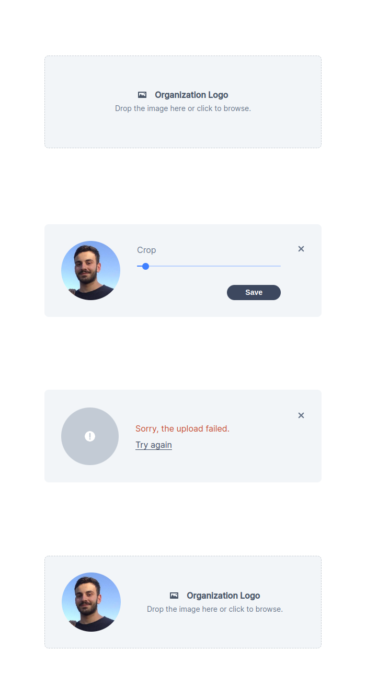

# Avatar-Upload


## 💻 Project

the Avatar-Upload is a project to upload your avatar.

## :hammer_and_wrench: Features

- [x] Upload all images.
- [x] Crop your avatar.

## ✨ Technologies

- [x] React
- [x] Typescript
- [x] Styled-Components
- [x] Jest
- [x] Testing-Library
- [x] React-Dropzone
- [x] Prettier
- [x] Eslint
- [x] Yarn
- [x] Vite

<h1 align="center">
  
</h1>

## Run the project

install depenencies with:
```cl
    yarn
```

run the project in dev mode:
```cl
    yarn dev
```

run the all tests:
```cl
    yarn test
```

<div align="center">
  <p>Developed by João Marcos</p>

  [](https://www.linkedin.com/in/jo%C3%A3o-marcos-belanga-60b8071b6/)

</div>
